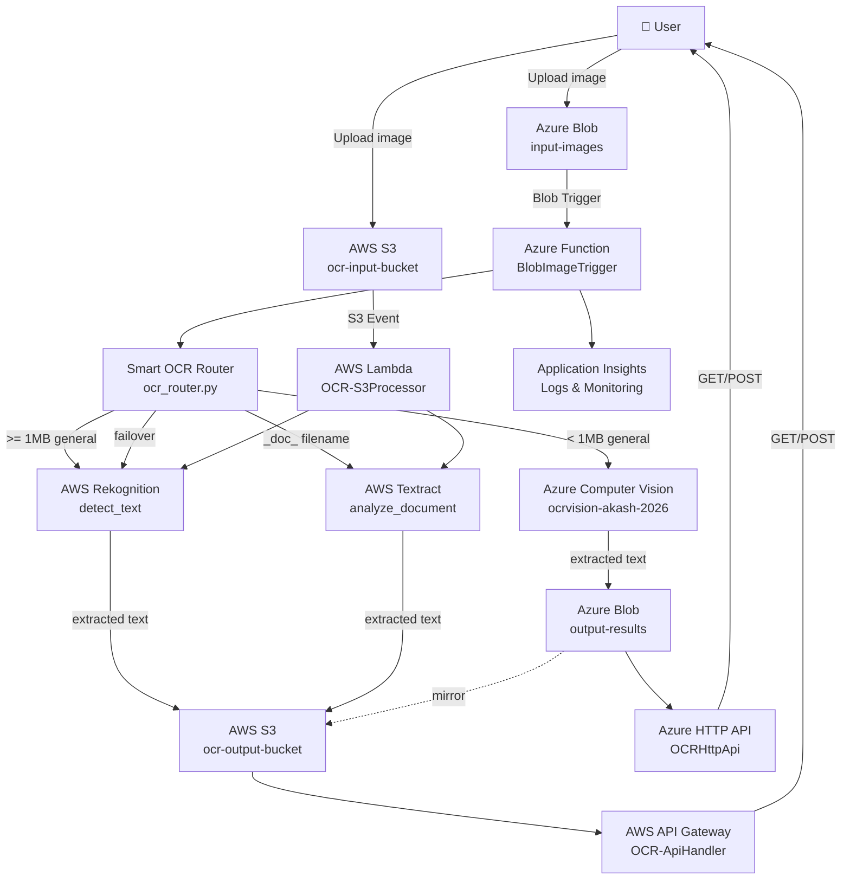

# Multi-Cloud OCR System — Azure + AWS

A **serverless, multi-cloud OCR pipeline** that automatically extracts text from images using Azure Computer Vision and AWS Rekognition/Textract, with smart routing, failover, and dual REST APIs.

---

## Architecture



---

## Project Structure

```
cloud-project/
├── azure-functions/
│   ├── BlobImageTrigger/          # Auto-trigger on blob upload
│   │   ├── __init__.py
│   │   └── function.json
│   ├── OCRHttpApi/                # Azure REST API (GET + POST)
│   │   ├── __init__.py
│   │   └── function.json
│   ├── shared/                    # Shared utilities
│   │   ├── ocr_router.py          # Smart routing + failover
│   │   ├── azure_vision.py        # Azure Computer Vision client
│   │   ├── aws_rekognition.py     # AWS Rekognition client
│   │   ├── aws_textract.py        # AWS Textract client
│   │   └── storage_helper.py      # Azure Blob + AWS S3 helpers
│   ├── host.json
│   ├── requirements.txt
│   └── local.settings.json.template
├── aws-lambda/
│   ├── s3_ocr_handler/            # S3-triggered Lambda
│   │   └── lambda_function.py
│   ├── api_handler/               # API Gateway Lambda (GET + POST)
│   │   └── lambda_function.py
│   └── deploy_lambda.sh           # Package + deploy script
├── infrastructure/
│   ├── azure_setup.md             # Azure CLI provisioning guide
│   ├── aws_setup.md               # AWS CLI provisioning guide
│   └── cost_model.md              # Per-request cost breakdown
├── tests/
│   ├── test_ocr_router.py         # Unit tests — routing logic
│   ├── test_azure_vision.py       # Unit tests — Azure Vision
│   ├── test_aws_rekognition.py    # Unit tests — Rekognition
│   ├── test_aws_textract.py       # Unit tests — Textract
│   └── integration_test.py        # End-to-end Azure + AWS test
├── .env.example
├── .gitignore
└── README.md
```

---

## Smart Routing Logic

```python
image_size < 1 MB AND azure available  →  Azure Computer Vision
image_size >= 1 MB                     →  AWS Rekognition
filename contains "_doc_" or ".pdf"    →  AWS Textract
Azure Vision fails                     →  AWS Rekognition (failover)
AWS Rekognition fails                  →  Azure Vision (failover)
Both fail                              →  Error logged
```

---

## Quick Start

### 1. Clone & Install

```bash
git clone <repo>
cd cloud-project
pip install -r azure-functions/requirements.txt pytest
```

### 2. Configure Credentials

```bash
cp .env.example .env
# Edit .env with your Azure + AWS credentials

# For Azure Function local dev:
cp azure-functions/local.settings.json.template azure-functions/local.settings.json
# Edit local.settings.json
```

### 3. Run Unit Tests (no credentials needed)

```bash
pytest tests/test_ocr_router.py tests/test_aws_rekognition.py \
       tests/test_aws_textract.py -v
```

### 4. Deploy Azure Functions

```bash
cd azure-functions/
func azure functionapp publish ocr-serverless-func
```

### 5. Deploy AWS Lambdas

```bash
cd aws-lambda/
bash deploy_lambda.sh all
```

### 6. Test End-to-End

```bash
# Upload to Azure
az storage blob upload \
  --account-name rgocrmulticloudacbc \
  --container-name input-images \
  --file tests/sample.jpg --name sample.jpg

# Upload to AWS
aws s3 cp tests/sample.jpg s3://ocr-input-bucket/sample.jpg

# Side-by-side comparison
python tests/integration_test.py --image tests/sample.jpg
```

---

## REST APIs

### Azure API

| Method | URL | Description |
|---|---|---|
| `POST` | `/api/ocr` | `{"blob_name": "img.jpg"}` → runs OCR |
| `GET` | `/api/ocr/{name}` | Fetch stored result |

### AWS API Gateway

| Method | URL | Description |
|---|---|---|
| `POST` | `/prod/ocr` | `{"s3_key": "img.jpg"}` → runs OCR |
| `GET` | `/prod/result/{key}` | Fetch stored result |

---

## Multi-Cloud Features

| Feature | Implementation |
|---|---|
| **Smart Routing** | Size + type-based provider selection |
| **Auto Failover** | Secondary provider if primary fails |
| **Cross-Cloud Mirror** | Azure results copied to S3 (redundancy) |
| **Serverless** | No servers to manage, auto-scaling |
| **Cost Optimization** | ~15–30% savings vs. single-cloud |

---

## Infrastructure

See [`infrastructure/azure_setup.md`](infrastructure/azure_setup.md) and [`infrastructure/aws_setup.md`](infrastructure/aws_setup.md) for full CLI provisioning commands.

See [`infrastructure/cost_model.md`](infrastructure/cost_model.md) for per-image cost breakdown and free tier details.

---

## Azure Resources

| Resource | Name |
|---|---|
| Storage Account | `rgocrmulticloudacbc` |
| Function App | `ocr-serverless-func` |
| Computer Vision | `ocrvision-akash-2026` |
| App Insights | `ocr-appinsights` |

## AWS Resources

| Resource | Name |
|---|---|
| S3 Input Bucket | `ocr-input-bucket` |
| S3 Output Bucket | `ocr-output-bucket` |
| Lambda (S3 trigger) | `OCR-S3Processor` |
| Lambda (API) | `OCR-ApiHandler` |
| IAM Role | `ocr-lambda-role` |
| API Gateway | `OCR-MultiCloud-API` |
